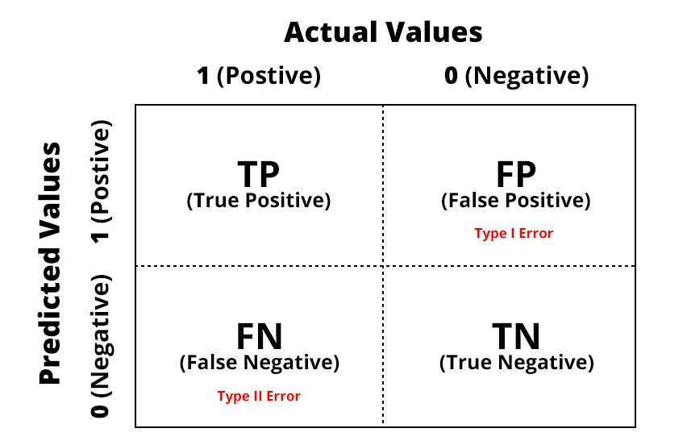

# Bank Deposito Marketing Campaign Model Prediction
---
## *Final Project Delta Team - JCDS2804*
---
Purwadhika Digital Technology School - Job Connector Data Science
* Ikhsan Herdi Fariyanto
* Sulaeman Nurhakim
* Muhammad Naufal Maahir
---

## 1. Backgroud

**Analisis Dataset Kampanye Pemasaran Bank: Penawaran Deposito Berjangka**  
Dataset ini menggambarkan hasil kampanye pemasaran sebuah bank di Portugal. Kampanye dilakukan terutama melalui panggilan telepon langsung kepada nasabah untuk menawarkan produk deposito berjangka.  
Jika setelah seluruh upaya pemasaran nasabah bersedia membuka deposito, maka target diberi label `yes`; jika tidak, diberi label `no`.

**Sumber Data:**  
[https://archive.ics.uci.edu/ml/datasets/bank+marketing](https://archive.ics.uci.edu/ml/datasets/bank+marketing)

---

## 2. Business Knowledge

**Konteks**  
Sebuah bank di Portugal telah melakukan kampanye pemasaran melalui telepon untuk menawarkan produk deposito berjangka. Namun, tingkat keberhasilan kampanye (conversion ratio) masih rendah.  
Pihak manajemen ingin meningkatkan efektivitas kampanye dengan mengidentifikasi karakteristik nasabah yang cenderung menerima penawaran deposito, sehingga strategi pemasaran dapat menjadi lebih terarah dan efisien.

**Target**  
- `yes` → Nasabah menerima tawaran deposito  
- `no` → Nasabah menolak tawaran deposito  

Target ini merupakan permasalahan **klasifikasi biner**.

---

## 3. Problem Statement

Proyek ini akan mencoba menjawab pertanyaan berikut:  
**Bagaimana memprediksi kemungkinan seorang nasabah menerima tawaran deposito berjangka berdasarkan data historis kampanye pemasaran dan profil nasabah, sehingga bank dapat menargetkan kampanye dengan lebih efektif?**

---

## 4. Goals

Tujuan utama proyek ini adalah:  

Berdasarkan permasalahan di atas, perusahaan ingin mengembangkan kemampuan untuk memprediksi kemungkinan nasabah menerima tawaran deposito dengan cara:

- Membangun pipeline machine learning end-to-end untuk memprediksi apakah nasabah akan menerima tawaran deposito.
- Mengidentifikasi faktor-faktor kunci yang memengaruhi keputusan nasabah melalui analisis feature importance.
- Menyediakan sistem rekomendasi prediksi yang siap pakai (deployment-ready) untuk mendukung keputusan tim pemasaran.

---

## 5. Stakeholders

Para pemangku kepentingan dalam proyek ini meliputi:

- **Manajemen Bank** → Membuat keputusan bisnis berdasarkan hasil prediksi.
- **Tim Pemasaran/Telemarketing** → Mengoptimalkan strategi dan segmentasi nasabah.
- **Nasabah Akhir** → Secara tidak langsung mendapatkan manfaat dari kampanye yang lebih relevan dan tidak mengganggu.

---

## 6. Analytical Approach

Proyek ini menggunakan pendekatan _modern machine learning pipeline_ yang mencakup:

- **Data Preparation:**  
  Pembersihan data, imputasi missing value, encoding variabel kategorikal, scaling, dan feature engineering untuk menghasilkan fitur yang lebih informatif.
- **Analisis Data Eksploratif (EDA):**  
  Menganalisis distribusi data dan hubungan antar fitur dengan target menggunakan visualisasi dan statistik ringkasan.
- **Penanganan Imbalanced Data:**  
  Menggunakan teknik resampling seperti SMOTE, RandomOverSampler, dan SMOTEENN untuk meningkatkan representasi kelas minoritas.
- **Modeling:**
  - **Baseline:** Logistic Regression
  - **Advanced:** Decision Tree, Random Forest, ExtraTrees, XGBoost, LightGBM, dan ensemble methods (Voting, Stacking)
  - **Ensemble & Threshold Tuning:**  
    Model ensemble (Voting Classifier) dipilih berdasarkan hasil recall tertinggi dan threshold tuning dilakukan untuk mengoptimalkan F2-score sesuai kebutuhan bisnis.
- **Model Evaluation:**  
  Evaluasi performa model menggunakan berbagai metrik dan visualisasi confusion matrix pada threshold optimal.
- **Interpretasi Model:**  
  Analisis feature importance untuk mendapatkan insight fitur-fitur utama yang memengaruhi prediksi.
- **Deployment:**  
  Model pipeline dilatih ulang pada seluruh data dan di-deploy ke aplikasi Streamlit untuk memudahkan user bisnis melakukan prediksi secara real-time.

---

## 7. Metric Evaluasion

> _Evaluasi dilakukan secara komprehensif dengan mempertimbangkan konsekuensi bisnis (FP vs FN) dan imbalance dataset._

- **True Negative (TN):** Model memprediksi nasabah *tidak* akan menerima tawaran deposito (`no`), dan kenyataannya memang *tidak* (`no`).
- **False Negative (FN):** Model memprediksi nasabah *tidak* akan menerima tawaran (`no`), padahal sebenarnya *iya* (`yes`).
- **False Positive (FP):** Model memprediksi nasabah *akan* menerima tawaran (`yes`), padahal sebenarnya *tidak* (`no`).
- **True Positive (TP):** Model memprediksi nasabah *akan* menerima tawaran (`yes`), dan kenyataannya memang *iya* (`yes`).

---

### Type I Error – False Positive

**Kasus:** Model memprediksi nasabah akan menerima tawaran deposito (`yes`), padahal sebenarnya tidak (`no`).  
**Konsekuensi Bisnis:**
- Waktu dan biaya telemarketing terbuang sia-sia
- Sumber daya pemasaran digunakan untuk nasabah yang tidak tertarik
- Efisiensi kampanye menurun

---

### Type II Error – False Negative

**Kasus:** Model memprediksi nasabah tidak akan menerima tawaran (`no`), padahal sebenarnya ya (`yes`).  
**Konsekuensi Bisnis:**
- Kehilangan peluang emas untuk mengonversi nasabah potensial
- Tingkat keberhasilan kampanye menurun
- Potensi nasabah bernilai tinggi terlewatkan

---

Dengan mempertimbangkan konsekuensi di atas, fokus utama model adalah **meminimalkan False Negative** (Type II Error), sehingga semakin banyak nasabah potensial yang benar-benar tertangkap oleh kampanye. Oleh sebab itu, **Recall** menjadi metrik evaluasi utama, didukung oleh F2 Score dan PR AUC untuk memastikan model tetap robust di dataset imbalanced.

---

- **Recall (Sensitivitas)**  
  Proporsi kejadian positif yang berhasil diprediksi dengan benar.  
  \[
  \text{Recall} = \frac{TP}{TP + FN}
  \]

- **Precision**  
  Proporsi prediksi positif yang benar-benar tepat.  
  \[
  \text{Precision} = \frac{TP}{TP + FP}
  \]

- **F1 & F2 Score**  
  F1 adalah rata-rata harmonis antara precision dan recall.  
  F2 lebih berat pada recall, sehingga sangat cocok untuk konteks ini.  
  \[
  F_\beta = (1+\beta^2) \cdot \frac{\text{Precision} \cdot \text{Recall}}{(\beta^2 \cdot \text{Precision}) + \text{Recall}}
  \]
  Dengan \(\beta = 2\), fokus utama ke recall.

- **PR AUC (Precision-Recall Area Under Curve)**  
  Luas area di bawah kurva Precision vs Recall pada berbagai threshold.  
  Sangat cocok untuk dataset yang tidak seimbang (imbalanced).

---

### Mengapa Recall dan F2 Score?

- Pada konteks pemasaran deposito berjangka, **missed opportunity** (False Negative) lebih merugikan, karena berarti kehilangan nasabah yang sebenarnya potensial.
- Model dengan recall tinggi akan **menangkap lebih banyak nasabah yang benar-benar tertarik** membuka deposito, meskipun harus mengorbankan sedikit efisiensi (precision).
- F2 Score dipilih untuk mengakomodasi kebutuhan bisnis yang lebih berat ke recall.
- PR AUC digunakan untuk memantau robustness model pada dataset yang imbalance.

---

### Business Implication

- **Recall Tinggi** → Semakin banyak nasabah potensial yang bisa dijangkau oleh tim pemasaran.
- **F2 Score** → Memastikan optimasi recall tetap sejalan dengan precision yang cukup.
- **Precision & PR AUC** → Memantau efisiensi campaign dan performa model pada imbalance dataset.
- **Feature Importance** → Insight untuk pengambilan keputusan strategi campaign selanjutnya.

---

**Dengan pendekatan pipeline modern, threshold tuning, dan deployment-ready pipeline, proyek ini memberikan solusi end-to-end yang bisa langsung digunakan oleh bisnis.**
